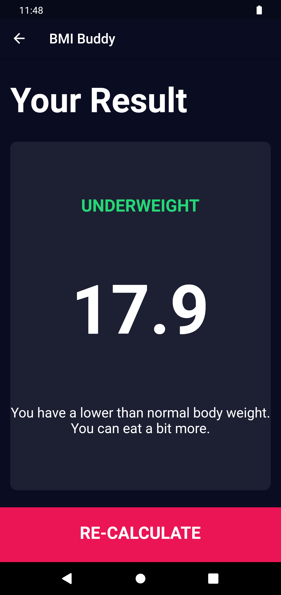

# BMI Buddy

A simple and easy to use Body Mass Index (BMI) calculator app built with Flutter. It works on Android, iOS, and Web.

## Features

- Calculate your BMI based on your weight and height
- Get an indication of whether your BMI is underweight, normal, overweight, or obese
- Clean and modern user interface

## Screenshots

## Getting Started

1. Install the app on your Android or iOS device, or access it on the web.
2. Enter your weight and height
3. Press the "Calculate BMI" button to see your BMI and an indication of whether it is underweight, normal, overweight, or obese

## Credit

The design of this app was inspired by the work of Ruben Vaalt [@rubenvalt](https://dribbble.com/rvaalt) from Dribbble [https://dribbble.com/shots/4585382-Simple-BMI-Calculato](https://dribbble.com/shots/4585382-Simple-BMI-Calculator)

Please note: This application is for reference only. It's not a substitute for professional medical advice. It's important to consult a medical professional for any health concerns.

Enjoy the app and take control of your health with BMI Buddy!
